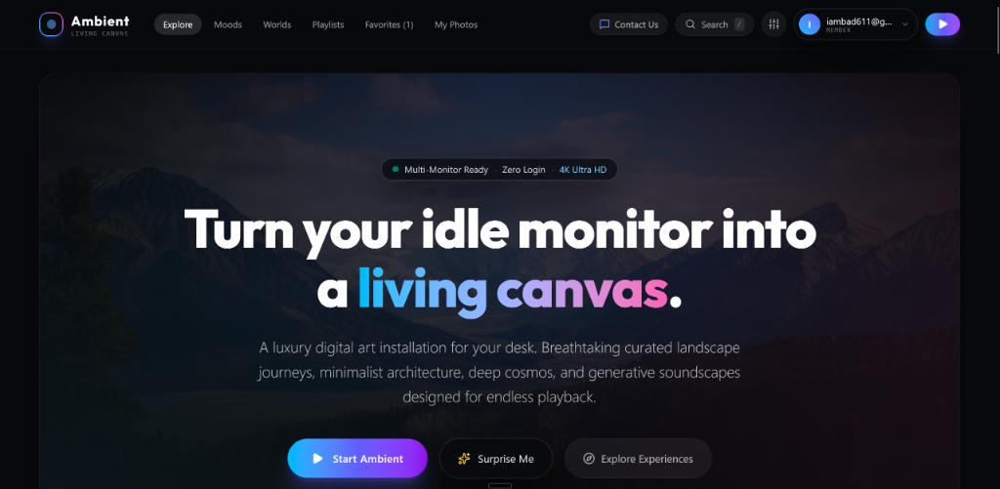
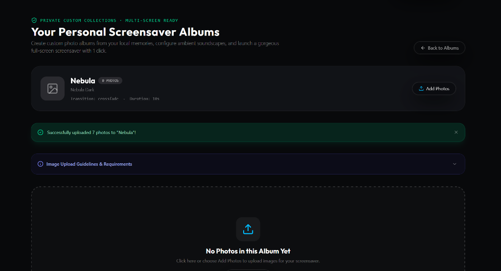

# Ambient: Living Canvas 🌌

> **Turn your idle monitor into a living canvas.**  
> A luxury digital art installation, ambient visual slideshow, and customizable screensaver web application designed for desk displays, secondary monitors, and smart TVs.

[](https://react.dev/)
[](https://www.typescriptlang.org/)
[](https://vite.dev/)
[](https://tailwindcss.com/)
[](https://supabase.com/)
[](https://zustand-demo.pmnd.rs/)
[](LICENSE)

---

## ✨ Overview

**Ambient** is an open-source visual experience crafted for people who work with multiple monitors, enjoy atmospheric desk setups, or want a cinematic screensaver that runs continuously in any modern web browser without memory leaks or heavy resource consumption.

Whether you need a serene alpine lake during deep focus sessions, cozy rain for relaxation, or want to showcase your own personal photo albums with custom particle effects and generative soundscapes, Ambient adapts to your mood in one click.

<p align="center">
  
</p>

---

## 🚀 Key Features

### 🌟 Curated Ambient Journeys
- **Breathtaking Collections:** Ultra-high-resolution curated visual scenes spanning alpine peaks, deep cosmic nebulas, coastal waves, architectural zen spaces, neon cyberpunk cities, and cozy firesides.
- **Continuous Cinematic Motion:** Subtle Ken Burns zooms, gentle panning, and buttery crossfades calibrated for all-day background playback.

### 🎭 Mood Calibrations
- **Feel-Driven Atmospheres:** Instantly filter and launch visual flows calibrated for specific mental states:
  - 🌿 **Peaceful:** Calming natural landscapes and gentle daylight.
  - 📐 **Focus:** Minimalist architecture, clean lines, and geometric symmetry.
  - ☕ **Cozy:** Warm hearths, rainy windowpanes, and golden interiors.
  - ⚡ **Energized:** Vibrant golden hours and dramatic lighting.
  - ✨ **Dreamy:** Pastel twilights, ethereal clouds, and cosmic vistas.
  - 🎬 **Cinematic:** Anamorphic compositions and dramatic horizons.

### 📸 Personal Screensaver & Album Studio ("My Photos")
- **Custom Album Builder:** Organize and name personal albums for family trips, design portfolios, or favorite memories.
- **Batch Photo Uploads:** Upload multiple photos simultaneously with a real-time progress bar.
- **Configurable Transitions:** Choose between Crossfade, Slide, Zoom In, or Ken Burns motion.
- **Particle Overlays:** Layer dynamic ambient particle effects over photos:
  - ❄️ *Gentle Snow*
  - ✨ *Floating Starlight*
  - 🔥 *Warm Embers*
  - 🌧️ *Soft Rain*
  - 🍃 *Falling Leaves*
- **Custom Display Durations:** Set precise per-slide durations (5s to 60s).

<p align="center">
  
</p>

### 🎵 Generative Ambient Audio & Soundscapes
- Integrated soundscape engine with independent volume control:
  - *Gentle Rain*
  - *Ocean Waves*
  - *Lo-Fi Beats*
  - *Crackling Campfire*
  - *Forest Breeze*
  - *White & Pink Noise*

### 🖥️ Zero-Distraction Multi-Monitor Experience
- **Auto-Hiding HUD:** Controls and cursor fade out automatically after 3 seconds of inactivity.
- **Full Widescreen Design:** Expands edge-to-edge on 1080p, 1440p, 4K, and Ultrawide displays without awkward side borders.
- **Zero-Login Quick Start:** Guests can click **Start Ambient** or **Surprise Me** immediately without creating an account.

### 🔐 Supabase Cloud Integration
- **User Accounts:** Sign up and log in securely with email and password.
- **Cloud Playlists & Favorites:** Synchronize custom playlists and favorite scenes across multiple computers or tablets.
- **Row-Level Security (RLS):** Fully isolated user data and private storage buckets for photo uploads.

### 🛡️ Admin Studio
- Dedicated administrative dashboard to curate public media items, manage user roles, and review incoming user feedback and contact submissions.

---

## ⌨️ Keyboard Shortcuts

| Shortcut | Action |
| :--- | :--- |
| <kbd>F</kbd> | Toggle Fullscreen Mode |
| <kbd>Space</kbd> | Pause / Resume Playback |
| <kbd>→</kbd> | Next Scene / Photo |
| <kbd>←</kbd> | Previous Scene / Photo |
| <kbd>M</kbd> | Mute / Unmute Soundscape Audio |
| <kbd>/</kbd> or <kbd>Ctrl</kbd> + <kbd>K</kbd> | Open Search Palette |
| <kbd>Esc</kbd> | Exit Screensaver / Close Modals |

---

## 🛠️ Tech Stack

- **Core Framework:** [React 19](https://react.dev/) + [TypeScript](https://www.typescriptlang.org/)
- **Build Tool:** [Vite 8](https://vite.dev/)
- **Styling:** [Tailwind CSS v4](https://tailwindcss.com/) with native CSS variables and modern glassmorphism
- **Icons:** [Lucide React](https://lucide.dev/)
- **State Management:** [Zustand 5](https://zustand-demo.pmnd.rs/) with localStorage persistence
- **Backend & Authentication:** [Supabase](https://supabase.com/) (PostgreSQL, Auth, Storage, RLS)
- **Code Quality:** [Oxlint](https://oxc.rs/)

---

## 🏁 Getting Started

### Prerequisites
- [Node.js](https://nodejs.org/) (v18.0.0 or higher recommended)
- `npm` (comes with Node.js) or `pnpm` / `yarn`
- A free [Supabase](https://supabase.com/) account (optional for local browsing, required for cloud sync & auth)

### Installation

1. **Clone the repository:**
   ```bash
   git clone https://github.com/your-username/ambient-living-canvas.git
   cd ambient-living-canvas
   ```

2. **Install dependencies:**
   ```bash
   npm install
   ```

3. **Configure Environment Variables:**
   Copy the example environment file:
   ```bash
   cp .env.example .env
   ```
   Open `.env` and fill in your Supabase project credentials:
   ```env
   VITE_SUPABASE_URL=https://your-project-id.supabase.co
   VITE_SUPABASE_ANON_KEY=your-anon-public-api-key
   ```
   *(If you don't configure Supabase, the app will run in local-only demo mode using offline storage).*

4. **Initialize Supabase Database (if using Supabase):**
   - Go to your Supabase project dashboard -> **SQL Editor**.
   - Copy the contents of [`supabase_schema.sql`](./supabase_schema.sql) and run it.
   - This creates all necessary tables (`profiles`, `user_albums`, `user_photos`, `user_playlists`, `feedback_submissions`), storage buckets, and security policies.

5. **Start the development server:**
   ```bash
   npm run dev
   ```
   Open your browser and navigate to `http://localhost:5173`.

---

## 📦 Building for Production

To create an optimized, minified production build:

```bash
npm run build
```

To locally preview the production build:
```bash
npm run preview
```

---

## 🌐 Deployment

### Deploying to GitHub Pages
1. Push your repository to GitHub.
2. In your repository on GitHub, go to **Settings** > **Secrets and variables** > **Actions** and add two repository secrets:
   - `VITE_SUPABASE_URL`
   - `VITE_SUPABASE_ANON_KEY`
3. Under **Settings** > **Pages**, set **Source** to **GitHub Actions**.
4. Create a deployment workflow in `.github/workflows/deploy.yml` that runs `npm ci`, `npm run build`, and deploys the `dist/` directory.

### Deploying to Vercel / Netlify
1. Import your GitHub repository into [Vercel](https://vercel.com/) or [Netlify](https://www.netlify.com/).
2. Add your environment variables (`VITE_SUPABASE_URL`, `VITE_SUPABASE_ANON_KEY`) in the provider dashboard.
3. Build command: `npm run build`
4. Output directory: `dist`
5. Deploy!

---

## 📁 Project Directory Structure

```text
Screensave & Visual Slideshow Web Application/
├── public/                 # Static assets (favicons, audio samples, logos)
├── src/
│   ├── components/
│   │   ├── admin/          # Admin Studio & content curation
│   │   ├── auth/           # Login, registration, user profile menus
│   │   ├── common/         # Navbar, modals, error boundaries, contact forms
│   │   ├── gallery/        # Experience cards, detail views, custom mix builder
│   │   ├── home/           # Hero banner, category browser, mood selectors
│   │   ├── local/          # User photo album manager & upload progress
│   │   ├── player/         # Fullscreen screensaver engine & particle canvases
│   │   ├── search/         # Quick search palette (Cmd/Ctrl + K)
│   │   └── settings/       # Audio, transition, and quality settings
│   ├── data/               # Curated starter media and categories
│   ├── services/           # Supabase client and storage APIs
│   ├── store/              # Zustand global state stores (player, catalog, album, auth)
│   ├── types/              # TypeScript interfaces and type definitions
│   ├── App.tsx             # Root application component with tab routing
│   ├── main.tsx            # Application entry point
│   └── index.css           # Tailwind v4 theme, animations & custom utilities
├── .env.example            # Environment variables template
├── .gitignore              # Ignored files (node_modules, .env, dist)
├── index.html              # Entry HTML template
├── package.json            # Project dependencies and npm scripts
├── supabase_schema.sql     # Complete PostgreSQL database schema & RLS rules
├── tsconfig.json           # TypeScript configuration
└── vite.config.ts          # Vite build & plugin configuration
```

---

## 🤝 Contributing

Contributions, feature ideas, and pull requests are warmly welcomed!
1. Fork the Project
2. Create your Feature Branch (`git checkout -b feature/AmazingFeature`)
3. Commit your Changes (`git commit -m 'Add some AmazingFeature'`)
4. Push to the Branch (`git push origin feature/AmazingFeature`)
5. Open a Pull Request

---

## 📄 License

Distributed under the MIT License. See [`LICENSE`](LICENSE) for more details.

---

<p align="center">
  Crafted with ❤️ for multi-screen enthusiasts and ambient art lovers.
</p>